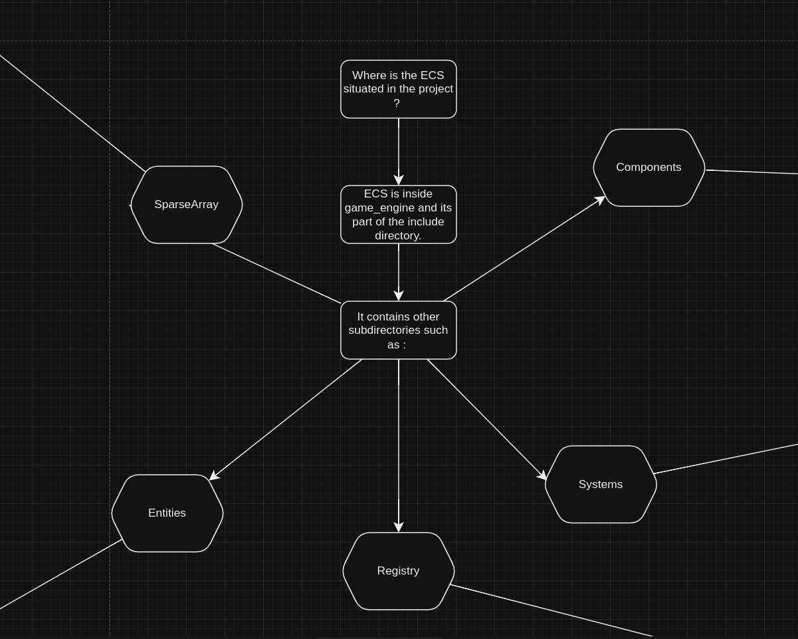

# Ecs diagram using Draw.io

The following diagram is a representation of the ECS architecture used in the project.

This markdown file will contain the diagram as images.
If you wish to see it and navigate through it, you can download the .drawio file and open it with [Draw.io](https://www.draw.io/)

## Different element of the ECS:

## Components

## Systems

## Registry

## SparseArray

## Entities
