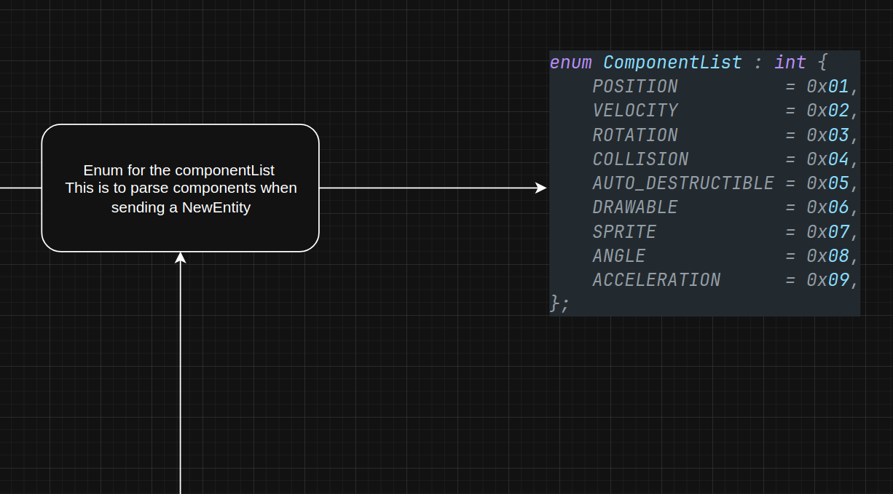

    ---
title: Binary protocol
parent: Rtype Server Protocol
grand_parent: Networking
nav_order: 1
---

# Binary protocol of R-Type

## Our R-Type binary protocol

## Text protocol example : 

## Binary protocol example :

## Sending a messages

## Serializing and deserializing

## Our own implementation for R-Type

# All enums, structures and functions

## Details of serialize and deserialize

## All structures used in the protocol

