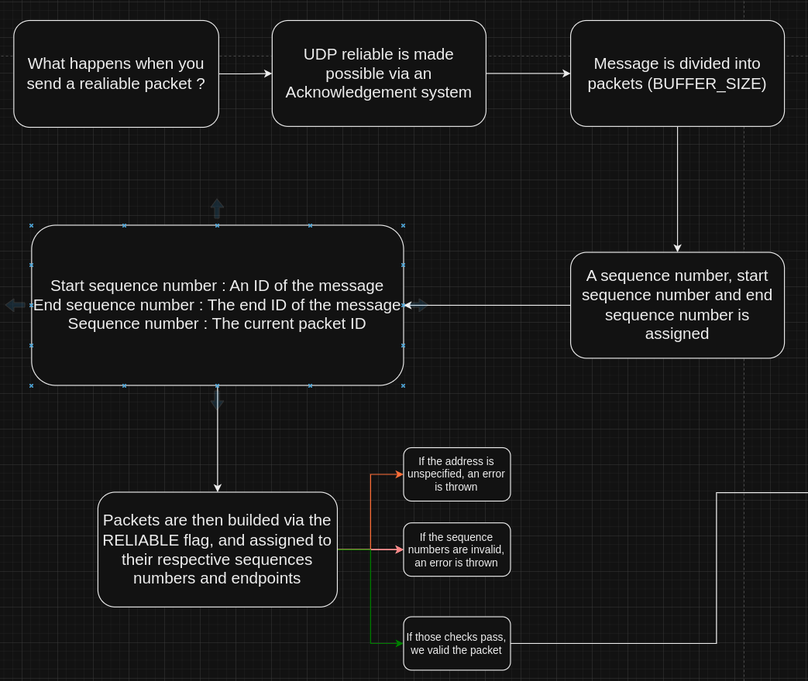
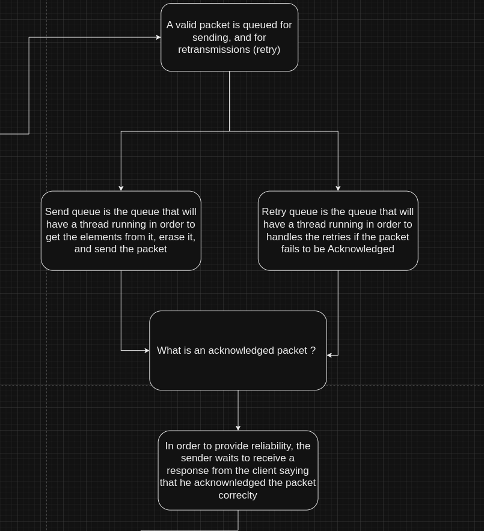
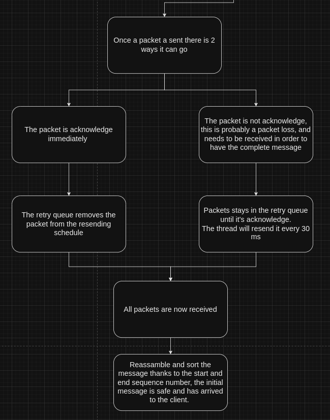

# Udp reliable packets documentation

## Overview

What are UDP reliable packets in the case of our networking engine?

UDP reliable packets are packets that are sent once and are guaranteed to arrive at the destination.

## Diagram

The diagram is here to help you understand what is going in the UDP reliable packets class (hpp/cpp).

First part : 

Second part :

Third part : 

