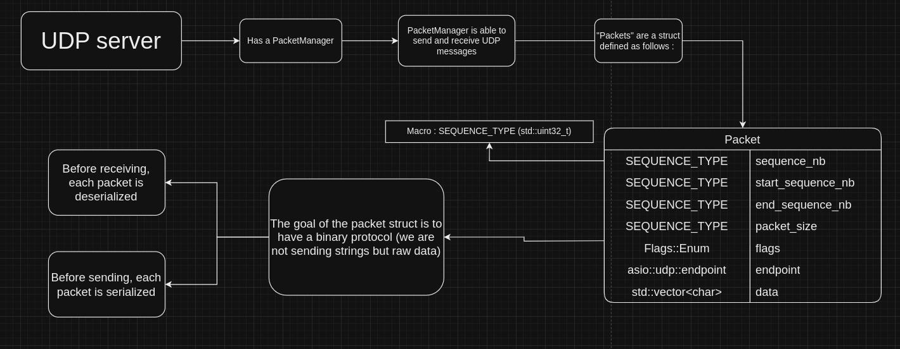

# UDP Server diagram

## Overview

What is an UDP Server in the case of our networking engine?

An UDP Server is a server that listens for incoming UDP packets on a specific port. When a packet is received, the server processes it and sends a response back to the client.

This document is not supposed to be used to create a new UDP Server, but to help you understand how the UDP Server class works in our networking engine.

## What is UDP ? 

UDP (User Datagram Protocol) is a connectionless protocol that works on top of IP. It is used to send packets of data from one host to another. It is faster than TCP, but it does not guarantee that the packets will arrive at the destination.

It is not reliable, but it is useful for real-time applications like video streaming, online gaming, etc.

You can have packet loss, duplication, and out-of-order packets. That's why you need to implement your own reliability layer on top of UDP if you need it.

## Diagram

The diagram is here to help you understand what is going in the UDP Server class (hpp/cpp).

## Packets

The UDP Server class uses the PacketManager class to manage the packets sent and received by the server and the clients.

Both a server and a client can send and receive packets.

As discussed earlier, UDP is not reliable, so we need to implement our own reliability layer on top of UDP.

We have two types of packets:
- **unreliable**: the packet is sent once and is not guaranteed to arrive at the destination [udp_unreliable_packets.md](udp_unreliable_packets.md).
- **reliable**: the packet is sent once and is guaranteed to arrive at the destination [udp_reliable_packets.md](udp_reliable_packets.md).