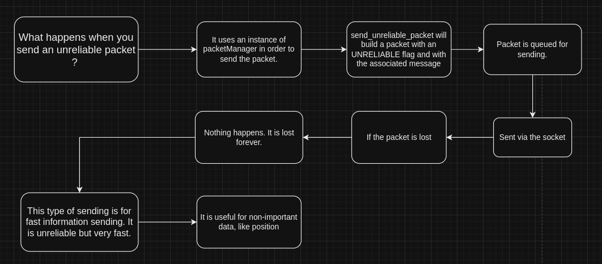

# Udp unreliable packets documentation

## Overview

What are UDP unreliable packets in the case of our networking engine?

UDP unreliable packets are packets that are sent once and are not guaranteed to arrive at the destination.

## Diagram

The diagram is here to help you understand what is going in the UDP unreliable packets class (hpp/cpp).

